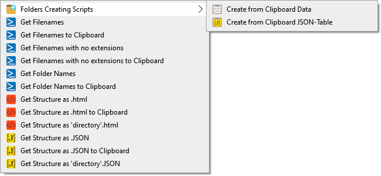
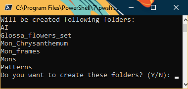
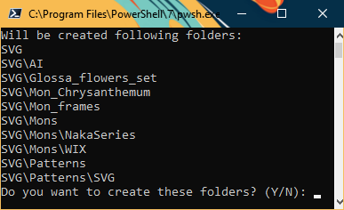

# Misc-Scripts


Just some scripts for me.

All scripts created with AI.

## PowerShell Lists Scripts



This scripts I use to generate files and folder lists.

I run it via context menu with command like «pwsh.exe -ExecutionPolicy RemoteSigned -File "(HERE SCRIPT PATH & NAME).ps1" "%V"»

[PowerShell 7](https://github.com/PowerShell/PowerShell) is a minimal recommended version.

### Collect .CSS into .MIN.CSS

[Compilator_CSS_Styles.ps1](https://github.com/DemerNkardaz/Misc-Scripts/blob/main/PowerShell/Compilator_CSS_Styles.ps1) collects all .CSS files in current directory and creating the .MIN.CSS from it.


### Files in Current Directory

[CurrentFiles.ps1](https://github.com/DemerNkardaz/Misc-Scripts/blob/main/PowerShell/CurrentFiles.ps1) & [CurrentFiles_Clip.ps1](https://github.com/DemerNkardaz/Misc-Scripts/blob/main/PowerShell/CurrentFiles_Clip.ps1) gets current directory file names, first script creates _files.txt, second just copy list to clipboard (with creating and removing temporary _files.txt).

[CurrentFiles_WithoutFormat.ps1](https://github.com/DemerNkardaz/Misc-Scripts/blob/main/PowerShell/CurrentFiles_WithoutFormat.ps1) & [CurrentFiles_WithoutFormat_Clip.ps1](https://github.com/DemerNkardaz/Misc-Scripts/blob/main/PowerShell/CurrentFiles_WithoutFormat_Clip.ps1) works identically of above, but creating list without file extensions in names.

### Folders in Current Directory

[CurrentFolders.ps1](https://github.com/DemerNkardaz/Misc-Scripts/blob/main/PowerShell/CurrentFolders.ps1) & [CurrentFolders_Clip.ps1](https://github.com/DemerNkardaz/Misc-Scripts/blob/main/PowerShell/CurrentFolders_Clip.ps1) similar of above for current directory folder names, output file is _folders.txt.

### Current Directory HTML-list structure

[GenerateHTML_Lists.ps1](https://github.com/DemerNkardaz/Misc-Scripts/blob/main/PowerShell/GenerateHTML_Lists.ps1) & [GenerateHTML_Lists_Clip.ps1](https://github.com/DemerNkardaz/Misc-Scripts/blob/main/PowerShell/GenerateHTML_Lists_Clip.ps1) is for generate a deep HTML list with spans of current directory with structure like this without file extension in names:

Output file _list.html.

[GenerateHTML_Lists_OutFileDirName.ps1](https://github.com/DemerNkardaz/Misc-Scripts/blob/main/PowerShell/GenerateHTML_Lists_OutFileDirName.ps1) creates .html file with current directory name.

[Sample of created .HTML](https://gist.github.com/DemerNkardaz/740b68b522aa1b0cff3a37c4c9f496d1) from Dawn of War — Soulstorm attrib folder.

```html
<li><span>ingame</span>
    <ul>
    <li><span>eldar_icons</span>
        <ul>
            <li><span>avatar_icon</span></li>
        </ul>
    </li>
    <li><span>event_cue_icons</span>
        <ul>
        <li><span>custom</span>
            <ul>
                <li><span>player_donation</span></li>
            </ul>
        </li>
        </ul>
    </li>
        <li><span>generic_icon</span></li>
    </ul>
</li>
```

### Current Directory JSON-table structure

[GenerateJSON_Lists.ps1](https://github.com/DemerNkardaz/Misc-Scripts/blob/main/PowerShell/GenerateJSON_Lists.ps1) & [GenerateJSON_Lists_Clip.ps1](https://github.com/DemerNkardaz/Misc-Scripts/blob/main/PowerShell/GenerateJSON_Lists_Clip.ps1) is for generate a deep JSON table similar of above with structure like this («link» is used for my some JS needs):

Output file _table.json.

[GenerateJSON_Lists_OutFileDirName.ps1](https://github.com/DemerNkardaz/Misc-Scripts/blob/main/PowerShell/GenerateJSON_Lists_OutFileDirName.ps1) creates .json file with current directory name.

Partial [Sample of created .JSON](https://gist.github.com/DemerNkardaz/8d886bc88743c2bc2e841e83bc85279b) from Dawn of War — Soulstorm attrib folder.

```json
{
    "root": [
        {
            "name": "ingame",
            "link": "",
            "childs": [
                {
                    "name": "eldar_icons",
                    "link": "",
                    "childs": [
                        {
                            "name": "avatar_icon",
                            "link": ""
                        }
                    ]
                },
                {
                    "name": "event_cue_icons",
                    "link": "",
                    "childs": [
                        {
                            "name": "custom",
                            "link": "",
                            "childs": [
                                {
                                    "name": "player_donation",
                                    "link": ""
                                }
                            ]
                        }
                    ]
                },
                {
                    "name": "generic_icon",
                    "link": ""
                }
            ]
        }
    ]
}
```

### Clipboard based Folders Creation

[CreateFolders_by_Clip.ps1](https://github.com/DemerNkardaz/Misc-Scripts/blob/main/PowerShell/CreateFolders_by_Clip.ps1) & [CreateFolders_by_ClipJSON.ps1](https://github.com/DemerNkardaz/Misc-Scripts/blob/main/PowerShell/CreateFolders_by_ClipJSON.ps1) is generates a folders based on you clipboard content:

First script generates folders based on strings in clipboard. Every new string = new folder.

Second script generates a deep folders structure based on JSON structure of JSON-generate script in above.


